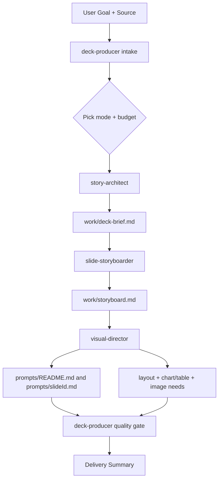
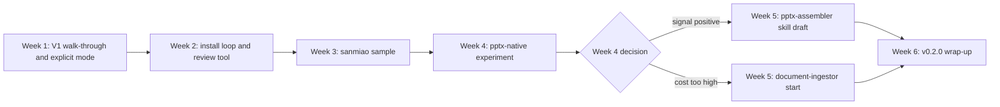

# Any2PPT V1 Roadmap

## Purpose

This roadmap turns the [Any2PPT plugin vision](any2ppt-plugin-vision.md) into a concrete six-week delivery schedule.

The main thread is "validate first, distill second, extend third". The first job is to prove that the V1 workflow really works end-to-end before adding new capabilities. The roadmap reuses the V1 plugin scope already defined in the vision document; it does not extend that scope, only sequences delivery and adds explicit checks.

## V1 Skill Responsibilities Recap

The schedule depends on each V1 skill having clear, non-overlapping responsibilities. This section recaps the four V1 skills before discussing weekly delivery.

### deck-producer

- Role: production owner. Only entry point of the plugin. Decides, schedules, and enforces quality gates. Does not produce content itself.
- Inputs: user goal, source material, requested output, optional budget mode.
- Outputs: production plan, artifact paths, calls to specialists, final delivery summary.
- Key decisions: what kind of source; which production mode (image-first, pptx-native, hybrid); which budget mode; which specialists to skip; when to apply quality gates.
- Does not: write thesis, storyboard, or prompts; never run without picking mode and budget.

### story-architect

- Role: narrative architect. Owns the deck-level thesis and structure.
- Inputs: source material plus any audience or purpose hints from deck-producer.
- Outputs: a single `work/deck-brief.md` containing source summary, intended audience, presentation goal, central thesis, narrative arc, section outline, material to exclude, risks/assumptions/fact-check needs.
- Key decisions: which thesis carries the deck; which arc fits; what to cut as off-topic; what claims need flagging instead of fabrication.
- Does not: write slide titles; cut slides; discuss visuals; call other specialists.

### slide-storyboarder

- Role: storyboarder. Owns slide sequencing and per-slide purpose.
- Inputs: `work/deck-brief.md`, or a user-provided outline (in which case story-architect is skipped).
- Outputs: a single `work/storyboard.md` where each slide has slide ID, title, primary job, core claim, 2-4 support points, recommended archetype, optional presenter intent.
- Key decisions: how many slides per section; archetype per slide; need for transition slides; archetype repetition control.
- Does not: change thesis or arc; write visual details or prompts.

### visual-director

- Role: visual director. Owns slide visual expression and (in image-first mode) image prompts.
- Inputs: `work/storyboard.md`, plus the chosen production mode.
- Outputs by mode:
  - image-first: `prompts/README.md` (global style) plus `prompts/<slide-id>.md` (per-slide complete prompts).
  - pptx-native: per-slide layout descriptions, chart and table needs, image needs without complete prompts.
  - hybrid: a mix, with explicit per-slide route assignment.
- Key decisions: global tone; visual form per slide (timeline, comparison, chart, map, etc.); full-image vs icon-and-text; font size and contrast standards.
- Does not: change thesis, arc, or storyboard structure; actually generate images; assemble PPTX.

### Data Flow

Skip rules: see [../plugins/any2ppt/references/workflow.md](../plugins/any2ppt/references/workflow.md).

## Six-Week Schedule

### Overview

Each week ships concrete deliverables and has a verification standard, so no week becomes open-ended exploration.

### Week 1 — Walk through V1 end-to-end and make production mode explicit

Goal: turn `local-runs/smoke-text-input` from an empty scaffold into a real run, and lift the `image-first / pptx-native / hybrid` decision from docs into the deck-producer skill.

Actions:

- Use the existing four skills (deck-producer, story-architect, slide-storyboarder, visual-director) to actually produce `smoke-text-input/work/deck-brief.md`, `work/storyboard.md`, `prompts/README.md`, and `prompts/<slide-id>.md`.
- Record every "skill text is unclear" or "artifact path collides" issue into `docs/v1-smoke-report.md`.
- Add a Production Mode section to [../plugins/any2ppt/skills/deck-producer/SKILL.md](../plugins/any2ppt/skills/deck-producer/SKILL.md): mode must be picked before budget, and each mode states which specialist outputs change.
- Add a "Mode-aware Flow" paragraph at the top of [../plugins/any2ppt/references/workflow.md](../plugins/any2ppt/references/workflow.md).

Deliverables:

- Real artifacts under `local-runs/smoke-text-input/work/` and `prompts/`.
- `docs/v1-smoke-report.md` with the issue list and proposed fixes.
- Updated `deck-producer/SKILL.md` and `references/workflow.md`.

Verification:

- A new reader can tell what the deck wants to say from the artifacts alone.
- `deck-producer` actively asks or infers the production mode instead of silently defaulting.

#### Week 1 Validation Checklist

The four skills already exist on paper, but the boundaries between them have not been stress-tested. The walk-through should explicitly check the following five points and log each finding into `docs/v1-smoke-report.md`.

1. **Does anyone ask for production mode?** Currently `deck-producer/SKILL.md` does not require picking a mode, so a default run will likely fall into image-first because `visual-director` defaults to writing prompts. Confirm whether mode selection happens; if not, harden the skill text.

2. **Section-to-slide cutting rule.** `story-architect` outputs a section outline, but neither skill specifies how many slides per section. Record what the storyboarder produces; if the page count drifts (3 sections to 12 pages, or 6 sections compressed to 5 pages), add a guideline.

3. **Slide ID consistency between storyboard and prompts.** `visual-director` should reuse the slide IDs given by `slide-storyboarder`, but no skill enforces this. Check whether `prompts/<slide-id>.md` filenames match the storyboard IDs one-to-one.

4. **Quality gate executor.** `deck-producer/SKILL.md` lists quality gates but does not say who runs them or how. Observe whether deck-producer reads all artifacts and runs the checklist, or whether the gate is silently skipped. This finding feeds the Week 2 `review` tool design.

5. **Specialist boundary discipline.** Will `story-architect` accidentally write slide titles? Will `slide-storyboarder` write visual descriptions? Each SKILL.md has a "does not" clause, but the walk-through is the first chance to verify they hold. Log any boundary violations and tighten skill text.

### Week 2 — install→use loop and executable critique

Goal: prove the plugin can be installed from the local marketplace into another working directory; turn [../plugins/any2ppt/references/critique-checklist.md](../plugins/any2ppt/references/critique-checklist.md) from a static document into a callable action.

Actions:

- In a temporary working directory outside this repo, install `any2ppt` via [../.agents/plugins/marketplace.json](../.agents/plugins/marketplace.json) and run a fresh small deck (5-7 slides, simple topic).
- Log onboarding pain points: which skill catches the request; whether `new-run` needs to be globally available; whether `work/` and `prompts/` paths work from a non-repo directory.
- Write `docs/install-and-use.md` containing the minimal repeatable steps.
- Add `any2ppt-dev review --run <name>` to [../tools/src/any2ppt_dev/cli.py](../tools/src/any2ppt_dev/cli.py), doing rule-based checks (no LLM yet):
  - `work/deck-brief.md` contains thesis, audience, and arc sections.
  - Each storyboard slide has title, primary job, core claim, and 2-4 support points.
  - Every slide ID in `prompts/` maps to one in the storyboard.
  - Output a markdown report at `dist/review.md`.

Deliverables:

- `docs/install-and-use.md`.
- Small deck artifacts in the temporary directory (paths registered in install-and-use.md).
- New `review` subcommand and a sample report on smoke-text-input.

Verification:

- Following install-and-use.md, a new user produces the first brief within 30 minutes.
- `review` finds at least one defect that was intentionally left from Week 1 (for example, missing support points).

### Week 3 — Distill sanmiao into a learnable sample

Goal: lift `local-runs/sanmiao-victory-day` (image-first success case) into an in-tree teaching sample.

Actions:

- Add `plugins/any2ppt/assets/sample-decks/sanmiao-victory-day/` with a slim version:
  - `brief.md`: thesis and arc only, no raw transcript.
  - `storyboard.md`: 8-slide table of slide IDs, titles, jobs, claims.
  - `prompts/<slide-id>.md`: cover plus 2-3 representative slide prompt excerpts, free of copyright-sensitive content.
  - `notes.md`: why this deck worked and which choices mattered.
- Excluded from the repo (kept in ignored `local-runs/`): raw audio, full transcripts, generated images.
- Add a "Reference Sample" section to both [../plugins/any2ppt/skills/visual-director/SKILL.md](../plugins/any2ppt/skills/visual-director/SKILL.md) and [../plugins/any2ppt/skills/story-architect/SKILL.md](../plugins/any2ppt/skills/story-architect/SKILL.md) pointing at the sanmiao sample.
- Document the in-repo sample rules (slim, shareable, no rights risk) in [development-layout.md](development-layout.md) under "Plugin Source".

Deliverables:

- Four files under `plugins/any2ppt/assets/sample-decks/sanmiao-victory-day/`.
- Reference Sample sections in two SKILL.md files.
- A sample-rules paragraph in development-layout.md.

Verification:

- Sample total size below 200 KB, plain text, no rights issues.
- A new specialist run can reuse the archetype choices after reading the sample.

### Week 4 — PPTX-native breaking experiment (decision point)

Goal: discover the real cost of pptx-native mode at minimum risk, to decide Week 5.

Actions:

- Without touching the plugin or deck-producer, add an experimental `pptx` subcommand under `tools/src/any2ppt_dev/`: `any2ppt-dev pptx draft --storyboard <path> --out <pptx>`, supporting two archetypes only: cover and thesis.
- Use `python-pptx` (add to [../tools/pyproject.toml](../tools/pyproject.toml) dependencies).
- Input: Week 1's `smoke-text-input/work/storyboard.md`. Output: `local-runs/smoke-text-input/dist/draft.pptx`.
- Open the file in PowerPoint and score subjectively: layout readability, font size, alignment, whitespace, assembly code volume.
- Write `docs/pptx-native-experiment.md` with a clear conclusion: continue investing or pivot.

Deliverables:

- `pptx draft` subcommand limited to two archetypes.
- `local-runs/smoke-text-input/dist/draft.pptx`.
- `docs/pptx-native-experiment.md` with a continue/pivot recommendation backed by quantification.

Verification:

- One command turns storyboard into a `.pptx` that PowerPoint opens and edits cleanly.
- The recommendation has numbers (lines of code per archetype, subjective quality x/10).

### Week 5 — Pick one route based on Week 4

Route A — continue pptx-native (if experiment positive):

- Add 3-4 more archetypes to `pptx`: comparison, evidence-cards, process, closing.
- Draft `plugins/any2ppt/skills/pptx-assembler/SKILL.md`: define the contract "accept storyboard, output .pptx, follow archetype templates" without implementing inside the plugin yet.
- Promote `pptx-native` mode in deck-producer from theoretical option to callable action.

Route B — pivot to document-ingestor (if cost too high):

- Draft `plugins/any2ppt/skills/document-ingestor/SKILL.md`, supporting PDF and URL inputs first.
- PDF reuses `~/.agents/skills/pdf`; URL uses a minimal fetcher (`any2ppt-dev ingest --pdf|--url` writes `source/input.md`).
- Extend `new-run` so a `--source` of PDF or URL invokes the ingestor automatically.

Deliverables (per route):

- A: 3-4 new archetype assembly code blocks plus `pptx-assembler/SKILL.md`.
- B: `document-ingestor/SKILL.md`, `any2ppt-dev ingest`, plus one PDF and one URL real ingest sample.

Verification:

- A: six archetype slides assembled cleanly from Week 1's storyboard.
- B: produce a deck-brief from one PDF source and one URL source.

### Week 6 — V1 wrap-up and v0.2.0

Goal: close the six-week loop and ship plugin v0.2.0.

Actions:

- Add 2-3 more content-aware rules to `review` (slide title length cap, archetype name validated against [../plugins/any2ppt/references/slide-archetypes.md](../plugins/any2ppt/references/slide-archetypes.md)).
- Sweep all four SKILL.md and four reference files in one pass to absorb Week 1-5 findings.
- Write `docs/v1-status.md`: what V1 shipped, what it did not, V2 candidates including the Week 4 outcome.
- Bump [../plugins/any2ppt/.codex-plugin/plugin.json](../plugins/any2ppt/.codex-plugin/plugin.json) to `0.2.0` and update description.
- Run `any2ppt-dev inspect` and `inspect-marketplace` cleanly; record the output in v1-status.md.

Deliverables:

- `docs/v1-status.md`.
- One-pass revisions of four skills and four references.
- `plugin.json` v0.2.0.
- Clean inspect/inspect-marketplace outputs registered.

Verification:

- A new person can produce the first deck-brief and storyboard within one hour using install-and-use.md and v1-status.md.
- No conflicting terminology between SKILL.md and references (production mode vs budget mode are uniformly named).

## Risks and Cadence Notes

- Week 1 is the only "must-do" week. If the walk-through reveals a major skill design issue, Weeks 2-3 may have to revise skills; in that case, push Week 3 (sanmiao sample) one week back rather than stacking work.
- The Week 4 decision point is the route fork. If pptx-native clearly fails to clear the subjective bar, switch to Route B without hesitation; do not burn two weeks on a weak path.

## Out of V1 Scope (deferred to V2+)

- YouTube ingestion.
- style-director skill.
- Local web UI.
- Editable overlays on top of image-first slides.
- Multi-pass critique loops.
- Automatic image generation calls inside the plugin.
